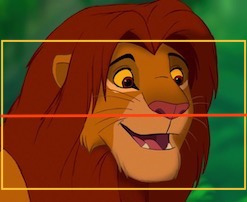
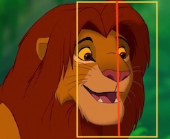
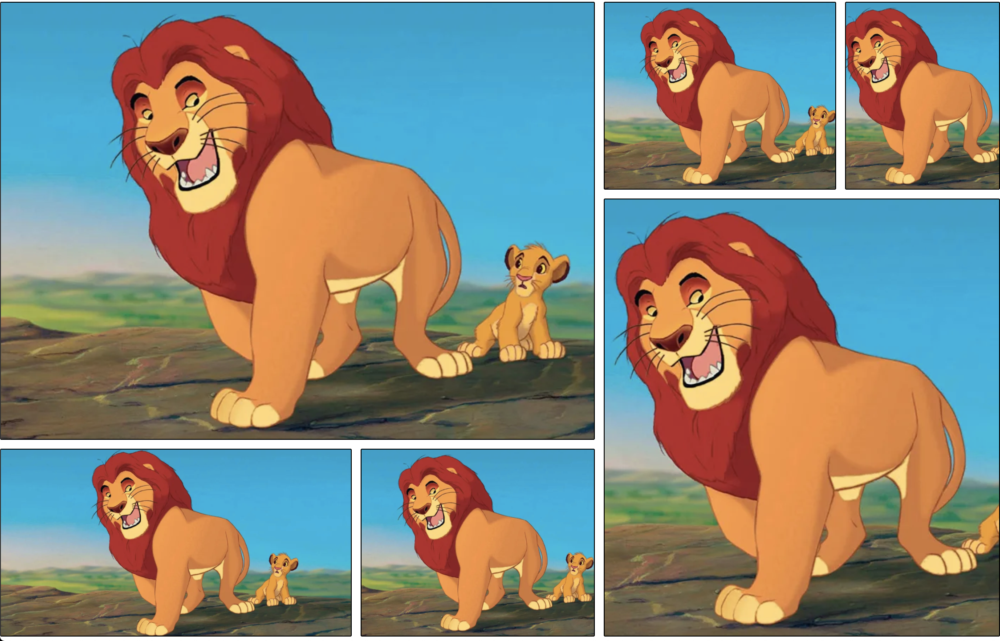

# NG-PHOTO-LIB

A Library containing the powerful libPhoto directive for displaying images. And some pre-made photo displaying components that make use of it.

## What it does

Displays an image in any size of container. Depending on how the shapes of the image and the container compare to one another, the image is cropped vertically or horizontally.

<div>
When the container is the exact dimensions of the image, the entire image is displayed like 
<div></div>
</div>

<div>
When the container has a wider ratio than the image, the photo is cropped vertically to fit like this
<div></div>
</div>

<div>
And when the container has a taller ratio than the image, the photo is cropped horizontally to fit.
<div></div>
</div>

<div>
For each image you may pass in a focus point as a percentage of the width and height, which centers the cropping (as much as possible)
Lets choose {x: 70, y: 58}, a point on the nose of Simba

<div></div>
</div>

<div>
Then the cropped results would look like this
<div></div>
</div>


## Usage

```
npm install --save ng-photo-lib@latest
```

### Directive uses:
```
<div libPhoto='http://myphotourl'>
```

```
<div [libPhoto]='{ url: "http://myphotourl", focusPosition: new Position({ x: 50, y: 50 })>
```

### Slideshow use:

```
<!-- Requires consumer to set the size of this component -->
<lib-photo-show [photos]='myPhotosArray' [interval]='10'></lib-photo-show>
```

### Gallery use: Takes exactly 6 photos

```
<!-- Requires consumer to set the size of this component -->
<lib-photo-gallery [photos]='myPhotosArray'></lib-photo-gallery>
```


<div>
The gallery looks like this, and is responsive such that the column on the right will drop below the column on the left on small screens.
<div></div>
</div>
